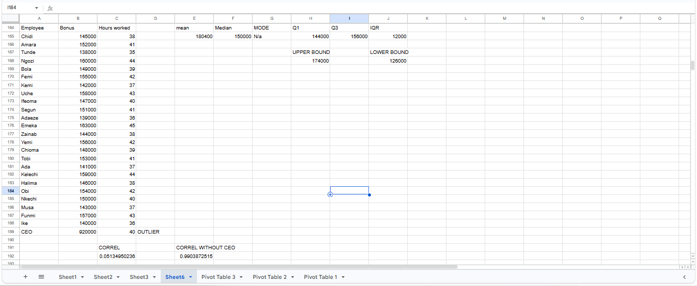

# Insight Memo: Bonus Pay Analysis

**Author:** Adefolami Adekogbe
**Dataset:** 25-employee Bonus / Hours Worked dataset (with one outlier record)

---

## Headline Finding

The average bonus of ₦180,400 overstates what a typical staff member actually receives. This figure is skewed upward by a single outlier — the CEO's ₦920,000 bonus — which falls well above the upper outlier bound of ₦174,000. The median bonus of ₦150,000 offers a more accurate picture of typical compensation.

## Key Stats

Bonus pay is right-skewed: the mean (₦180,400) sits well above the median (₦150,000), a gap that signals a small number of high values are pulling the average upward. This is confirmed by the interquartile range (Q1 = ₦144,000, Q3 = ₦156,000, IQR = ₦12,000), which shows most staff bonuses cluster tightly between ₦144,000 and ₦156,000 — far from the mean.

## Outlier Note

Applying the IQR method, values exceeding ₦174,000 (upper bound) or falling below ₦126,000 (lower bound) are classified as outliers. The CEO's bonus of ₦920,000 substantially exceeds the upper bound — more than five times the threshold — and is therefore identified as a clear statistical outlier. No values fall below the lower bound, indicating this is the only outlier present in the dataset.

## Correlation Finding

The correlation between bonus and hours worked is 0.05 when the CEO is included — effectively no relationship. Excluding the CEO, however, the correlation rises to 0.99, indicating an almost perfect linear relationship. This shift occurs because the CEO's hours worked (40) are unremarkable, while their bonus (₦920,000) is extreme — this single point distorts the calculation for the full dataset, even though the remaining 24 employees show a near-perfect bonus-to-hours pattern.

While this correlation is strong, correlation does not establish causation. It is unclear whether working more hours leads to a larger bonus, or whether staff in higher-paying roles are simply expected to work more hours. A likely confounding variable is seniority or role level — more experienced or senior staff may both work longer hours and receive larger bonuses independently, without either variable directly causing the other.

## Recommendation

Before drawing conclusions from these figures, it would be useful to know each employee's role, seniority level, and department — this would clarify whether the hours–bonus relationship reflects genuine performance-based pay or simply reflects role-based differences in both variables.

---

*Skills demonstrated: descriptive statistics (mean, median, mode), skew diagnosis, IQR outlier detection, correlation analysis, correlation-vs-causation reasoning, confounding variable identification.*
