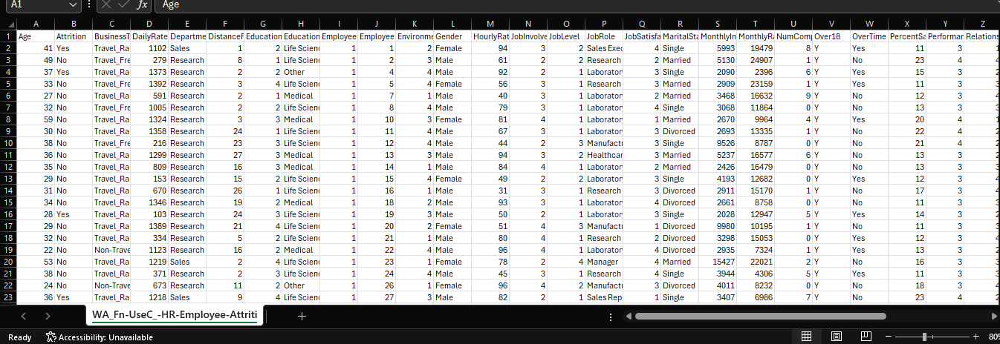
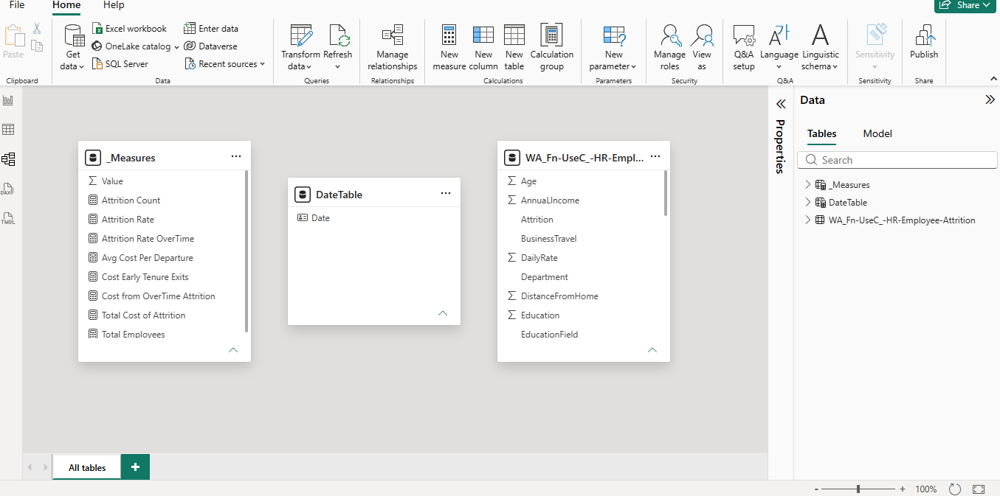
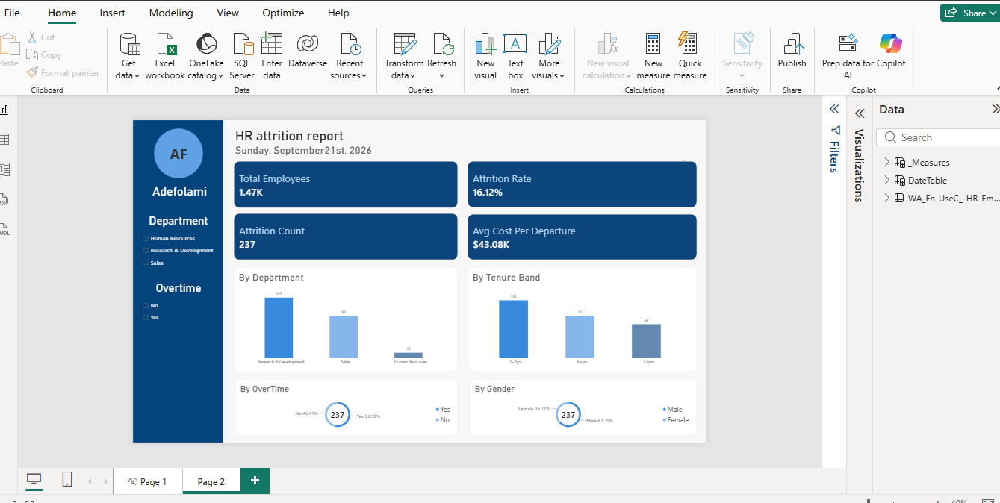

[README.md](https://github.com/user-attachments/files/32779000/README.md)
# HR Attrition & Cost Dashboard

An interactive Power BI dashboard analyzing employee attrition patterns and quantifying the financial impact of turnover across departments, tenure bands, and demographic groups.

## Table of Contents
- [Project Overview](#project-overview)
- [Dataset](#dataset)
- [Data Cleaning & Transformation](#data-cleaning--transformation)
- [Data Modeling](#data-modeling)
- [DAX Measures](#dax-measures)
- [Dashboard Design](#dashboard-design)
- [Dashboard Breakdown](#dashboard-breakdown)
- [Key Insight](#key-insight)
- [Tools Used](#tools-used)
- [How to View](#how-to-view)

## Project Overview

Employee attrition is one of the most expensive problems an organization can face — not just in recruitment costs, but in lost productivity, training investment, and institutional knowledge. This dashboard was built to answer a practical business question: **where is attrition concentrated, and what is it actually costing the company?**

This project is the capstone of a self-directed Power BI learning phase, bringing together data transformation (Power Query), data modeling, DAX measures, and dashboard UX principles into a single end-to-end build — following on from an earlier SQL project analyzing e-commerce trends.

## Dataset

The data used is the **IBM HR Analytics Employee Attrition dataset**, sourced from Kaggle. It is a widely used, anonymized HR dataset containing employee-level records including demographics, job role, department, tenure, overtime status, and attrition outcome (whether the employee left the company).

[Dataset link](https://www.kaggle.com/datasets/pavansubhasht/ibm-hr-analytics-attrition-dataset)

## Data Cleaning & Transformation

All transformation was done in **Power Query** before loading the data into the model:

- **Renamed columns** for clarity and consistency, so measures and visuals reference intuitive names rather than raw dataset headers
- **Fixed data types** — corrected fields imported as text/general into their proper types (numeric, date, categorical) so aggregations and DAX calculations would evaluate correctly
- **Created calculated columns**, including grouping raw tenure values into readable **Tenure Bands** used throughout the report, and deriving the fields needed to support the Department, Overtime, and Gender breakdowns

- **TenureBand = Table.AddColumn(#"Removed Columns", "TenureBand", each if [YearsAtCompany] <= 2 then "0-2yrs" else if [YearsAtCompany] <= 5 then "3-5yrs" else "6+yrs")**

## Data Modeling

The report uses a single-table model built directly from the cleaned dataset, with calculated columns (e.g. Tenure Band) added at the model layer to support grouping in visuals without needing separate lookup tables.


## DAX Measures

Custom DAX measures power the core KPIs rather than relying on default column aggregations:

- **Attrition Rate** — Attrition Count divided by Total Employees, using `DIVIDE()` to safely handle any zero-denominator edge cases
- **Avg Cost Per Departure** — a custom measure estimating the average financial impact per employee exit
- Supporting measures driving the dynamic breakdowns by Department, Overtime, Tenure Band, and Gender

```dax
Attrition Rate = DIVIDE([Attrition Count], [Total Employees], 0)
```
Avg Cost Per Departure = DIVIDE([Total Cost of Attrition], [Attrition Count])
Total Cost of Attrition = SUMX(
    FILTER('WA_Fn-UseC_-HR-Employee-Attrition', 'WA_Fn-UseC_-HR-Employee-Attrition'[Attrition] = "Yes"),
    'WA_Fn-UseC_-HR-Employee-Attrition'[AnnualIncome] * 'WA_Fn-UseC_-HR-Employee-Attrition'[ReplacementCostMultiplier]
)

## Dashboard Design

https://github.com/user-attachments/assets/c5488733-d2c9-4a92-b3b3-504b5e267a20
Layout follows core dashboard UX principles: a clear headline visual (Attrition Rate and Attrition Count sized prominently at the top), consistent alignment and grouping of related visuals, and deliberate whitespace so the report reads top-to-bottom without clutter. Sidebar slicers (Department, Overtime) let viewers filter the entire page interactively rather than reading static numbers.

## Dashboard Breakdown

**Top-level KPIs:**
- **Total Employees:** 1.47K
- **Attrition Count:** 237
- **Attrition Rate:** 16.12%
- **Avg Cost Per Departure:** $43.08K

**Visual breakdowns:**
- **By Department** — compares attrition volume across Human Resources, Research & Development, and Sales, highlighting which department is losing the most staff
- **By Overtime** — splits attrition between employees who regularly work overtime and those who don't, surfacing whether overtime correlates with higher turnover
- **By Tenure Band** — segments attrition by how long employees stayed before leaving, useful for spotting whether turnover is concentrated in new hires or long-tenured staff
- **By Gender** — shows attrition distribution by gender for demographic context

**Filters:** Department and Overtime slicers in the sidebar apply across the whole page, allowing interactive drill-down into any segment.

## Key Insight


**Attrition here isn't a company-wide problem — it's concentrated in the first two years of employment, and that concentration is what's driving the bulk of your cost.**

Breaking down the numbers here
- Of the 237 total departures, the **0-2 years tenure band accounts for roughly 102 of them** — that's about 43% of all attrition sitting in just the newest-hire segment, nearly double the next band (3-5 yrs, ~68) and comfortably ahead of 6+ yrs (~75, spread over a much longer tenure window)
- At **$43.08K average cost per departure**, that early-tenure band alone represents somewhere around **$4.4M of your $10.21M total attrition cost** — meaning early-career exits, not veteran turnover, are the single biggest cost driver in the whole dataset

**Why this matters analytically:** a company often assumes attrition is either random or concentrated among long-tenured "burnt out" staff.  The data says the opposite — people are leaving fastest right after being hired, when the company has *just* absorbed the full cost of recruiting and onboarding them and hasn't yet recouped that investment through their productive output. That's a fundamentally different (and more expensive) problem than veteran turnover, because you're paying the replacement cost repeatedly on people who barely got started.

**The supporting layer:** Sales and R&D show the highest attrition counts by department, and this lines up with the OverTime split — people working overtime attrite at a meaningfully higher rate than those who don't. So the fuller story your dashboard tells is: **new hires in high-overtime departments (Sales, R&D) are leaving fast, and it's costing roughly $4M+ a year specifically because the company keeps re-paying onboarding costs on people who don't stay past year two.**

That's the kind of finding that turns "here's an attrition dashboard" into "here's a specific, fixable retention problem" — 

## Tools Used

- **Power BI Desktop** — data modeling, DAX measures, and report/visual design
- **Power Query (M)** — data cleaning and transformation
- **DAX** — custom measures for attrition rate, cost calculations, and dynamic breakdowns

## How to View

The `.pbix` file is included in this repository. To explore it interactively:
1. Download [Power BI Desktop](https://powerbi.microsoft.com/desktop/) (free)
2. Open the `.pbix` file
3. Use the Department and Overtime slicers on the left to explore attrition across segments


